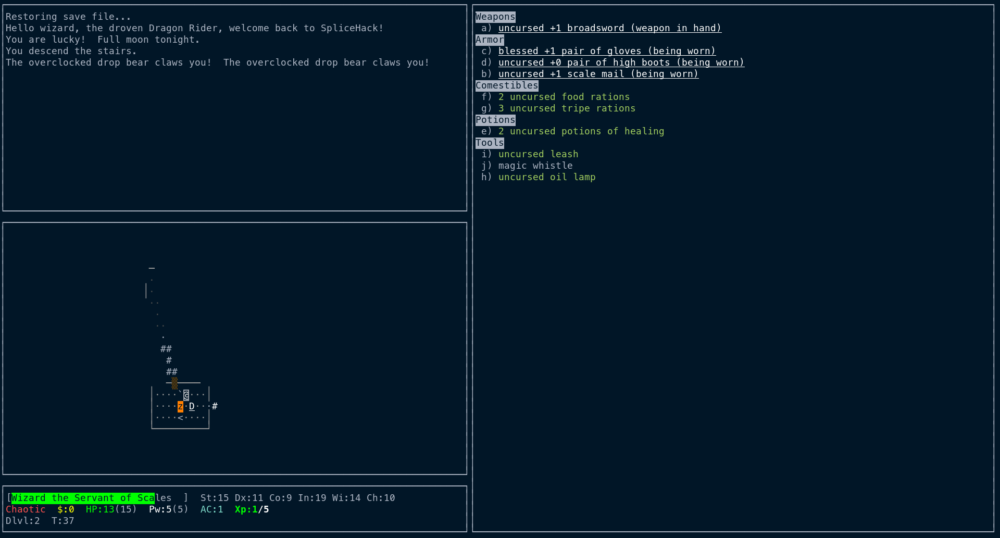
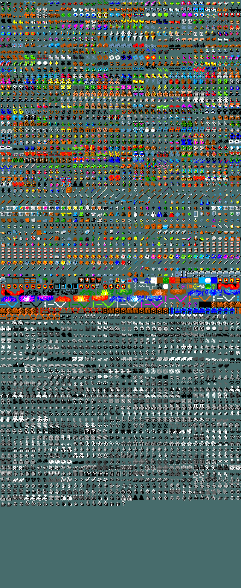

#                  SpliceHack 1.1.0 -- General information

SpliceHack is an in-progress fork of NetHack 3.7 (and in part, SLASH'EM), made with the goal of adding
additional monsters, items, special levels, and game features without changing
too much of the core gameplay. The end goal is a "kitchen sink" variant that is 
still intuitive and easy to pick up and play for anyone familiar with vanilla NetHack.

## Features
* Monsters riding other monsters.
* The option to play as nonbinary and choose your orientation.
* Hundreds of new foes to fight.
* Dozens of new items to collect.
* An extended, more challenging endgame.
* So much more...

Suggestions and criticism of the game are welcome. This variant is very much a
work in progress, and as such bugs and balance issues may exist. Bug reports, 
suggestions for new features, questions, and pull requests can be directed 
to this variant's github page.

## How to Play
- The latest stable SpliceHack release can be downloaded from https://github.com/NullCGT/SpliceHack/releases.
- SpliceHack is hosted online at https://www.hardfought.org.
- Advanced users can compile SpliceHack from the source using the same steps as one
  would use to compile NetHack 3.7.
- For a detailed changelog, you can read doc/changelog.md.

## Configuration
The first question most new players have about NetHack is how to configure the game
so that it looks nice, they can disable autopickup, and so on and so forth. For 
information about customizing NetHack, refer to https://nethackwiki.com/wiki/Options.
The steps for customizing SpliceHack are the same as the steps for
customizing NetHack, except the file to edit is named .splicehackrc.

If you don't want to spend time writing a configuration file from scratch, this
repository contains a file named .splicehackrc.example for Unix systems. Simply
copy the file to the relevant location, rename it, and modify it to your heart's
content.

### Configuration File Locations

* **Windows:** %USERPROFILE%\NetHack\.splicehackrc
* **OSX:** ~/.splicehackrc
* **Linux:** ~/.splicehackrc

## Tiled Mode
SpliceHack contains a tileset, and can be played in graphical or ascii mode depending
on the preference of the user. Some of the tiles in the tileset are based on those
found in vanilla, others are based on tiles from SLASH'EM, and others still are entirely
original.

A copy of this tileset is included for reference. Feel free to modify it or use it as
a basis for your own tilesets.

## Why the Rewrite?

When I started writing SpliceHack, I wasn't as opinionated or as skilled of a developer
as I am now, and I had much less experience in balancing a game and making it fun to play.
This rewrite is an effort to improve both the code and the gameplay of SpliceHack, so 
that it's more enjoyable and easier to maintain.

## Collborators and Acknowledgements

SpliceHack's development is currently being driven by the following individuals.

- AntiGulp (Admin)
- Rojja Spicycat Flump-Cebolla

Special thanks go out to qt, K2, aosdict for being frequent contributors to and
influences on the code, and K2 for hosting it publicly. Credit to the vanilla dev
team and all unnamed contributors to vanilla NetHack as well, without whom none
of this would exist.

SpliceHack is largely derived from NetHack 3.7 and SLASH'EM, but pulls features
from numerous other NetHack variants. A more comprehensive list of sources can
be found in the [sources file](sources.txt).

## Contributing

Please see contributing.md.

## Disclaimer

SpliceHack follows the conditions put forth in the license provided by the
NetHack Dev Team (see dat/license). If you are aware of any licensing or
permissions issues with SpliceHack, please contact us through github.

#                  SpliceHack - The Design Philosophy

SpliceHack's design philosophy has evolved over time. At present, these are the standards that should be considered when creating a pull request for SpliceHack.

1. SpliceHack should remain as accessible to new players as possible. There are a number of
   ways to ensure this:

  1.1. For every monster and item, a corresponding tile must exist.

  1.2. Try to keep to the loose rules NetHack provides for how to color monsters.

  1.3. When adding a new mechanic, consider adding a corresponding rumor.

2. Tedium and grind are to be avoided, and any change that reduces tedium or grind should be
   prioritized.

3. Changes that make the midgame and lategame more interesting should be prioritized.

4. Instant death should, in general, be avoided. While methods of dying instantly exist, such as
   drinking an entire keg of booze or attempting to drink lava out of a furnace, these are the
   exception rather than the rule.

5. Being silly is fine; NetHack is built in part upon silliness. Avoid being too silly, however.
   A pun-based item interaction is fine; a One-Eyed One-Horned Giant Purple Amoeba Eater monster
   is not.

6. Any change to the "canon" of the game, such as the identity of the player, must be carefully
   considered, and existing lore must be taken into account.

7. Hateful, edgy, and otherwise objectionable content should be avoided. SpliceHack is a game
   for everyone.
   
   7.1 Although the language of the external game may change, sometimes the source code will stay
       the same. This is for the purposes of remaining semi-compatible with Vanilla's codebase, as
       well as because of the sheer size of the codebase, and the danger of large scale replacements.
       As an example, "culture" is used over "race" ingame, but not in the codebase, since changing
       it in the code would involve replacing hundreds of lines, and break all compatibility with
       vanilla NetHack. Although this is obviously not an ideal solution, it is temporarily workable.

#                  -- Good luck, and happy Hacking --
                  
NetHack may be freely redistributed.  See license for details.